# Logical Flow Diagrams — `lab/`

Flow diagrams for each concurrency scenario in the **finds** lab, showing both the **buggy** and **fixed** code paths.

---

## 1. Module Dependency Overview

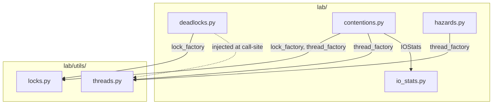

---

## 2. Deadlock — Circular Wait ([`deadlocks.py`](file:///Users/greg/Documents/finds/lab/deadlocks.py))

### UploadBackend: Buggy Path (Circular Wait → Deadlock)

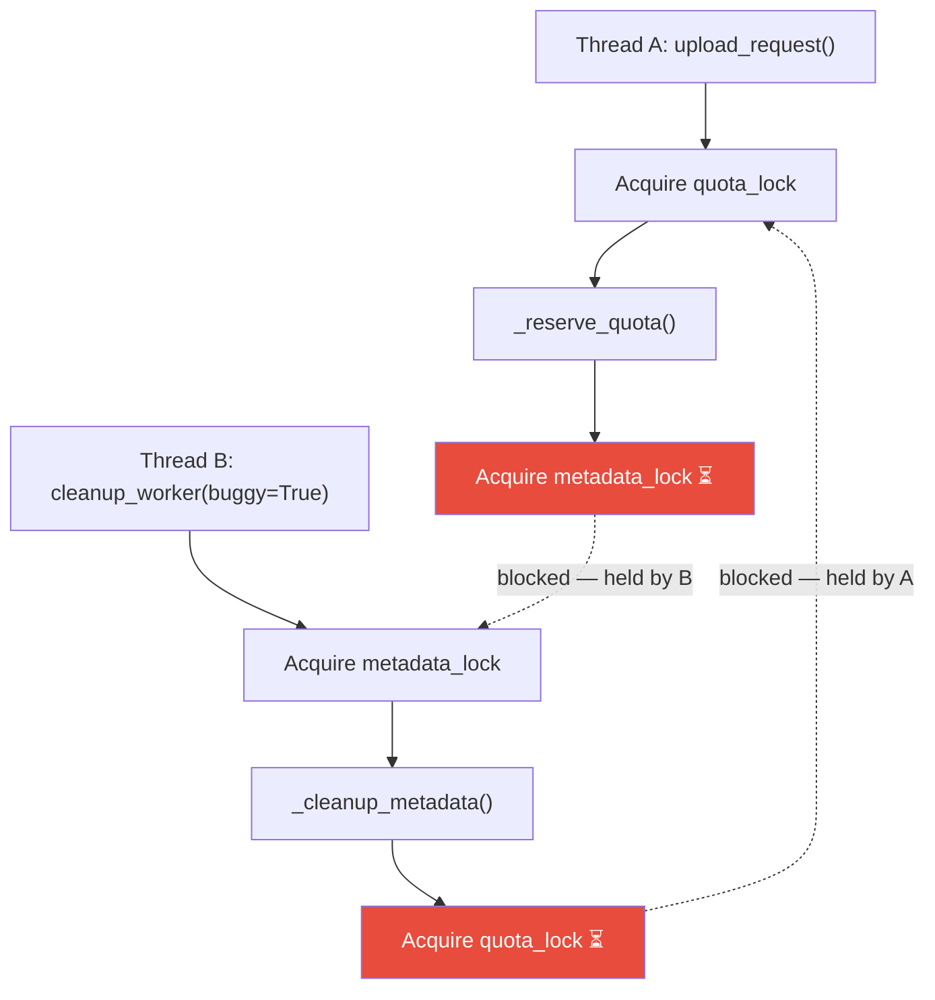

> [!CAUTION]
> **Thread A** holds `quota_lock` and waits for `metadata_lock`; **Thread B** holds `metadata_lock` and waits for `quota_lock`. Neither can proceed — **deadlock**.

### UploadBackend: Fixed Path (Consistent Lock Ordering)

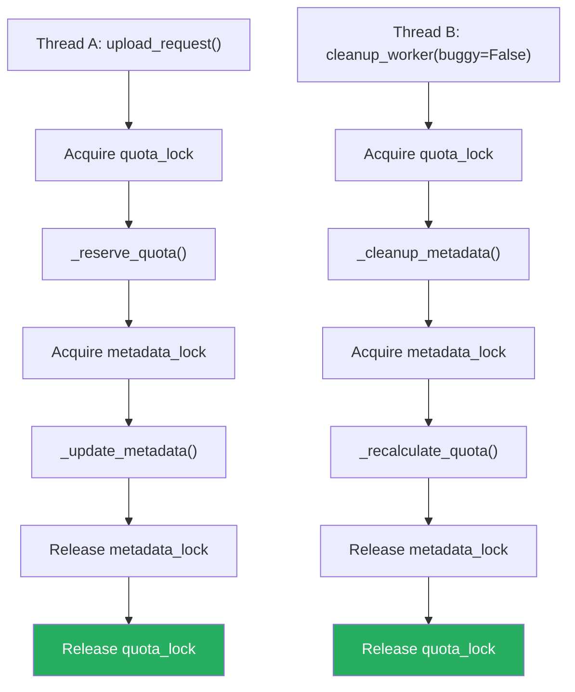

> [!TIP]
> Both paths acquire locks in the **same order** (`quota` → `metadata`), preventing circular wait.

---

## 3. Thread Contention — Hot-Lock ([`contentions.py`](file:///Users/greg/Documents/finds/lab/contentions.py) · `SharedCounter`)

### Buggy Path: Serialised Hot-Lock

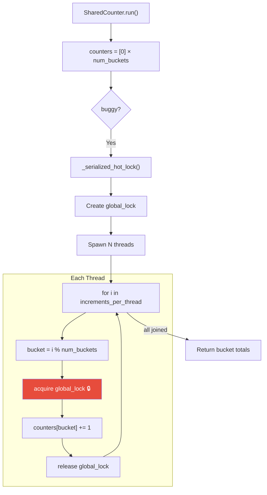

> [!WARNING]
> Every increment across all threads serialises on a **single global lock** — threads spend almost all time waiting, not working.

### Fixed Path: Private (Sharded) Counters

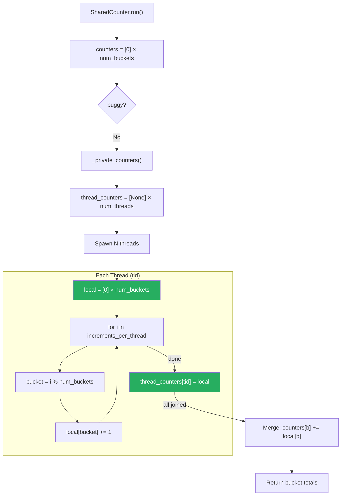

> [!TIP]
> Each thread works on **private counters** — zero lock contention during the hot loop. Results are merged once after all threads finish.

---

## 4. I/O Contention — Storage Writers ([`contentions.py`](file:///Users/greg/Documents/finds/lab/contentions.py) · `StorageWriterPool`)

### Overall Flow

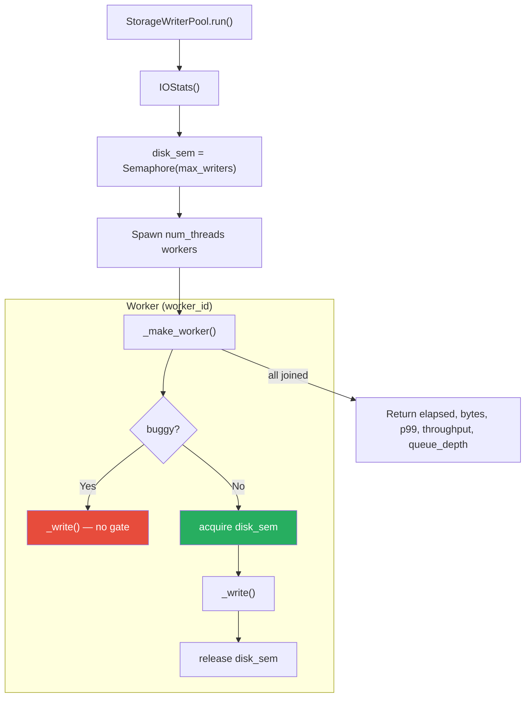

### `_write()` Detail

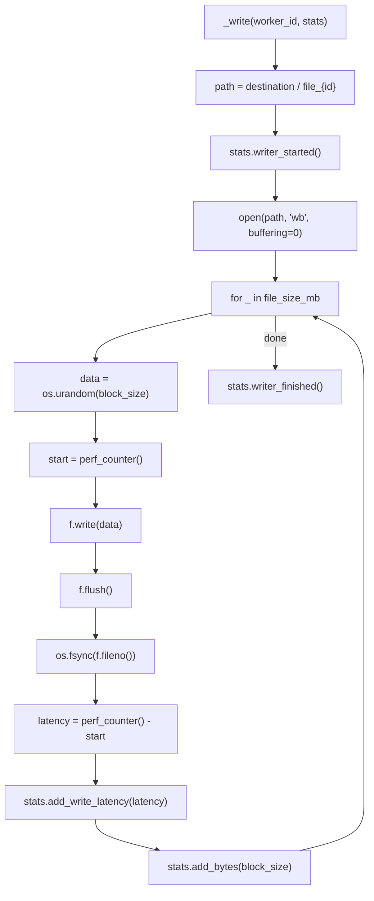

> [!IMPORTANT]
> **Buggy**: All 64 writers hit the storage simultaneously → high queue depth, elevated p99 latency.
> **Fixed**: `Semaphore(max_writers=16)` gates writer concurrency, keeping queue depth within controller capacity.

---

## 5. CPU Contention — Compute Workers ([`contentions.py`](file:///Users/greg/Documents/finds/lab/contentions.py) · `ComputeWorkerPool`)

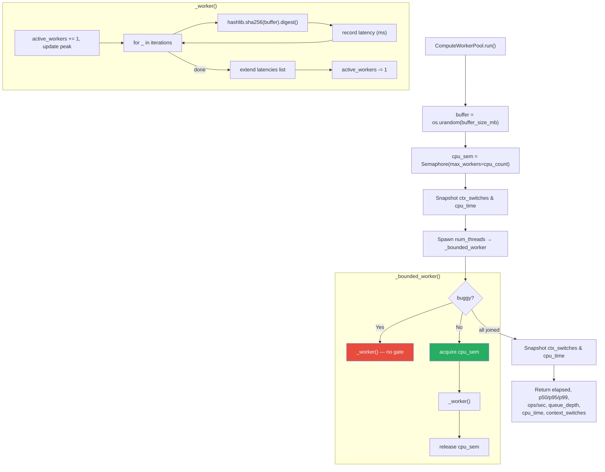

> [!IMPORTANT]
> **Buggy**: 64 threads all compete for `cpu_count` cores → involuntary context switches spike, per-op latency increases.
> **Fixed**: Semaphore limits active workers to `cpu_count`, minimising scheduler pressure and cache thrashing.

---

## 6. TOCTOU Race — Upload Quota ([`hazards.py`](file:///Users/greg/Documents/finds/lab/hazards.py))

### Buggy Path: Check-Then-Act Without Lock

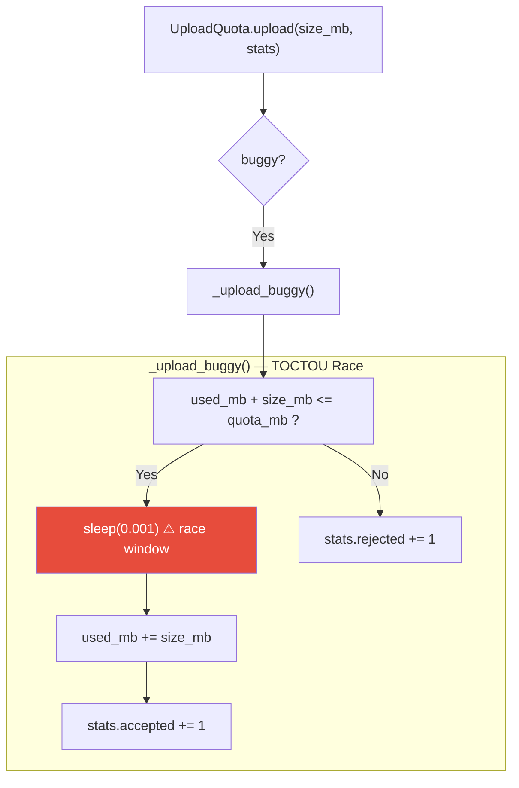

> [!CAUTION]
> Between the quota **check** and the **update**, other threads can pass the same check — quota is oversubscribed.

### Fixed Path: Atomic Check-and-Reserve

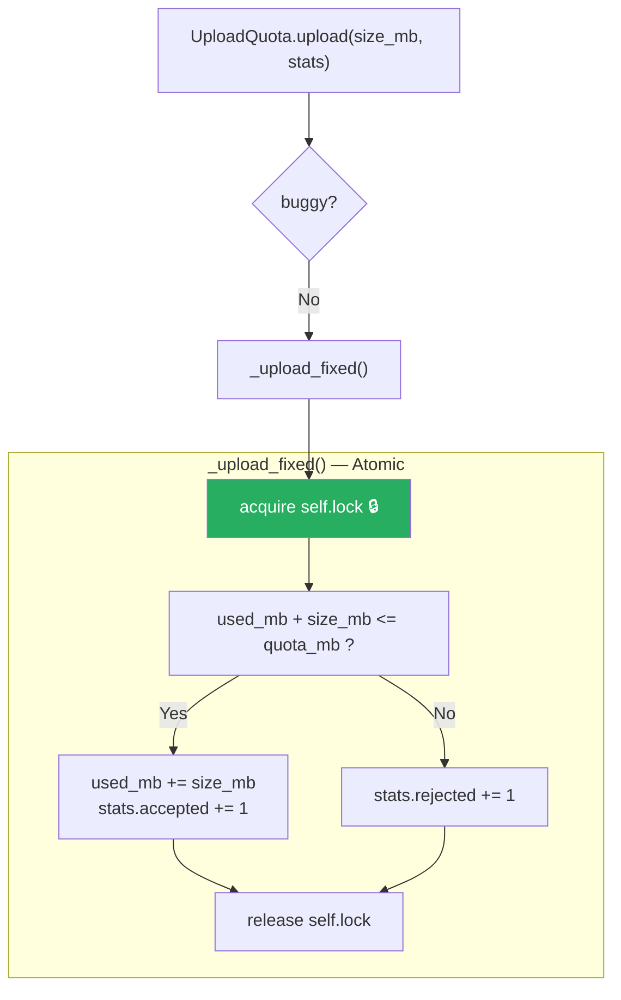

### UploadQuotaPool Orchestration

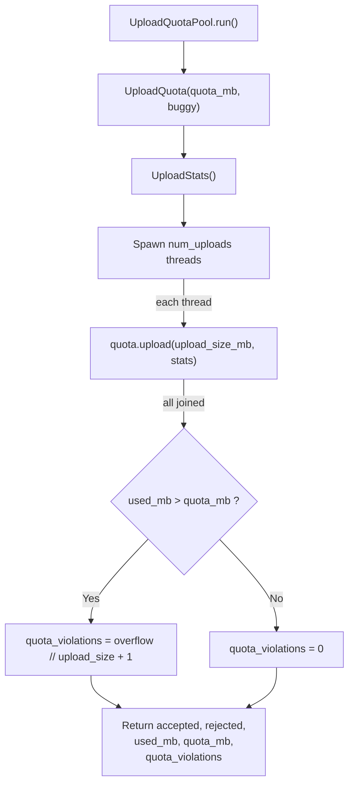

---

## 7. IOStats — Thread-Safe Statistics Collector ([`io_stats.py`](file:///Users/greg/Documents/finds/lab/io_stats.py))

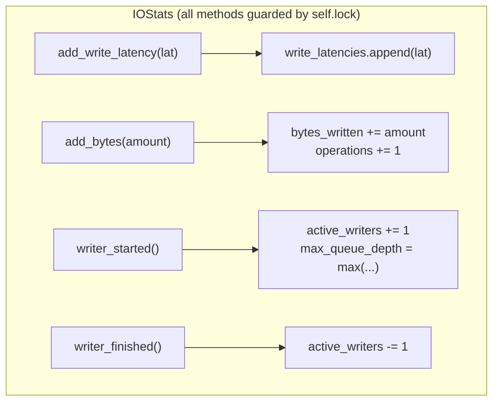

---

## 8. Utility Factories ([`utils/`](file:///Users/greg/Documents/finds/lab/utils))

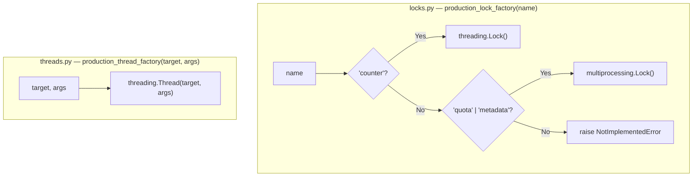

> [!NOTE]
> Factories are injected into `SharedCounter`, `StorageWriterPool`, `ComputeWorkerPool`, and `UploadBackend`, enabling **test/instrumented locks and threads** to be swapped in without changing business logic.
