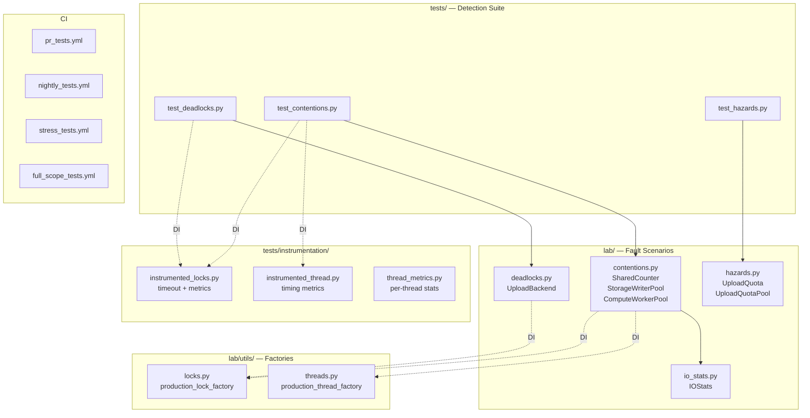
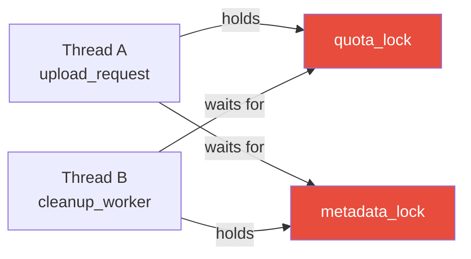
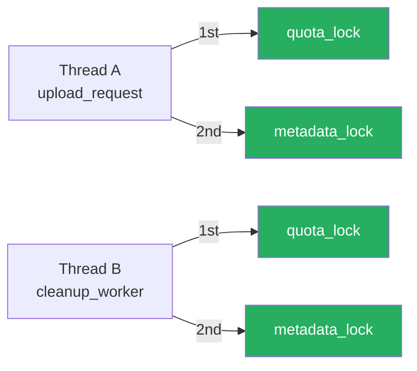
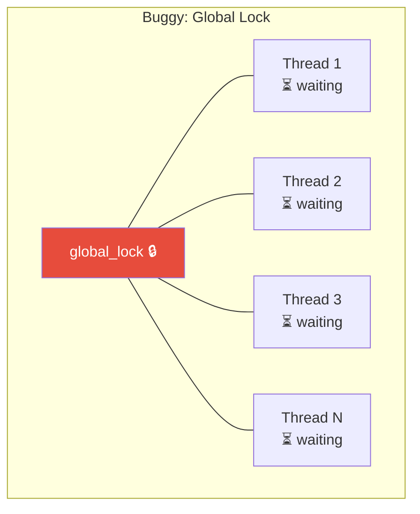
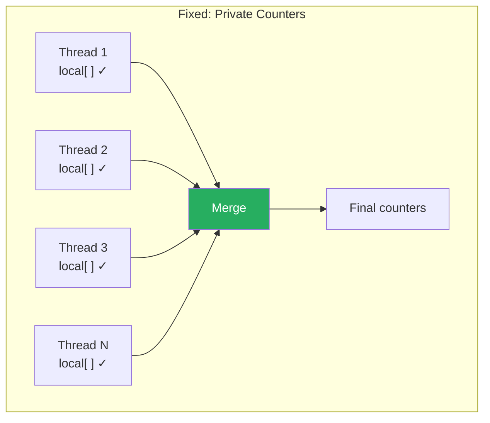
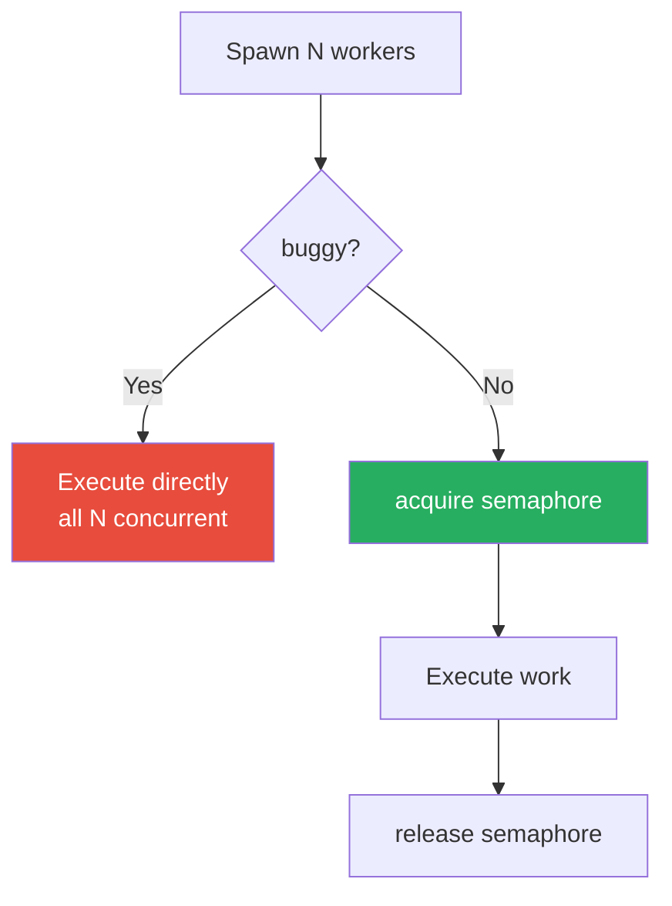
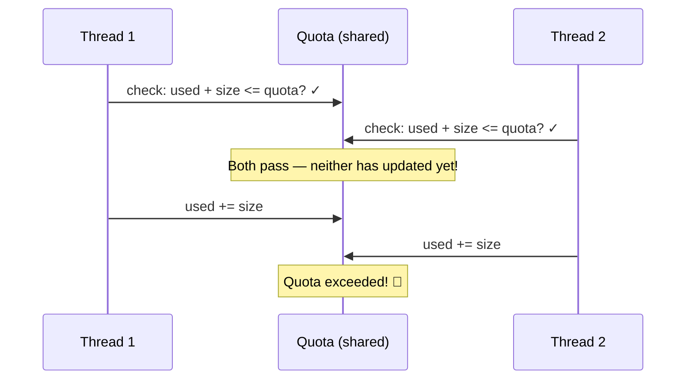
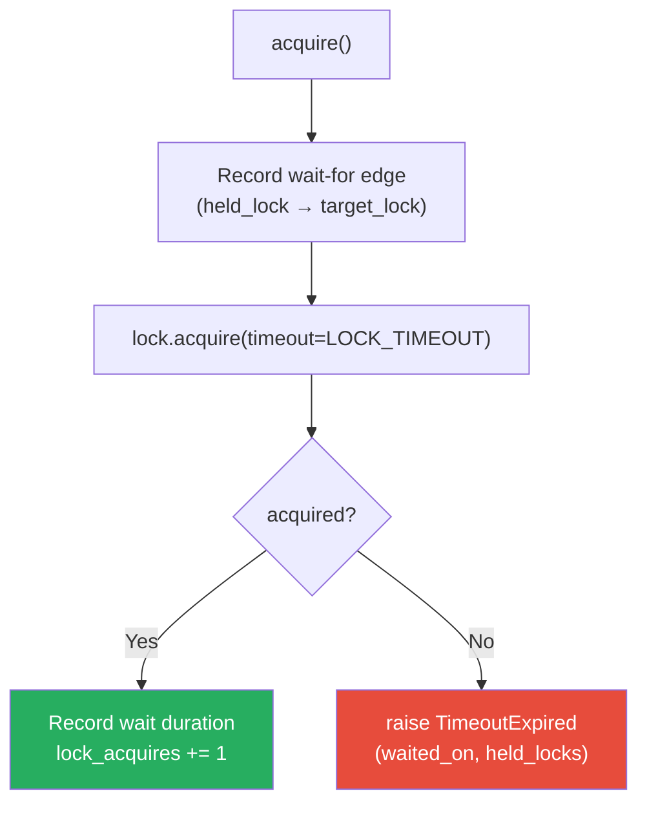
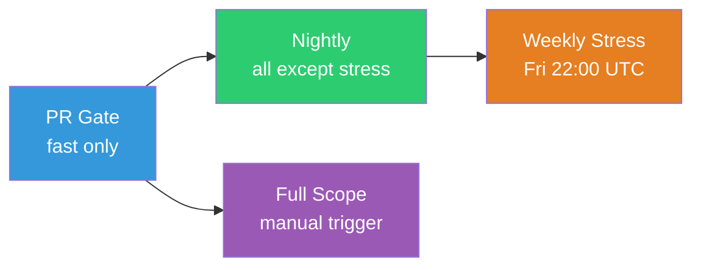

# finds — Fault INjection & Detection Suite

### Interview Presentation

---

## 🎯 Elevator Pitch

**finds** is a pytest-based framework that **injects realistic concurrency faults** — deadlocks, contention, race conditions — into realistic service stubs and **reliably detects them** through instrumented locks, statistical analysis, and conservation-law assertions.

Every fault scenario has a **buggy** path (fault active) and a **fixed** path (correct implementation), both exercised by the same test suite.

---

## Slide 1 — The Problem

> Concurrency bugs are the hardest class of bugs to find, reproduce, and fix.

| Challenge | Why it's hard |
|-----------|--------------|
| **Non-deterministic** | Bugs depend on thread scheduling — may not reproduce locally |
| **Silent** | Data corruption without crashes (TOCTOU), or hangs without errors (deadlocks) |
| **Latent** | Hot-locks degrade throughput gradually — no single failure to trigger an alert |
| **Environment-sensitive** | I/O contention behaves differently on SSD vs NAS vs CI runner |

**Goal**: Build a framework that makes these bugs *deterministic*, *detectable*, and *CI-friendly*.

---

## Slide 2 — Architecture Overview



> [!IMPORTANT]
> **Dependency Injection** is the backbone: production code (`lab/`) never imports test instrumentation. Factories are swapped at the test fixture level.

---

## Slide 3 — Design Principles

### 1. Toggleable Faults

```python
# Every scenario exposes a buggy flag
backend = UploadBackend(lock_factory=factory, buggy=True)   # fault active
backend = UploadBackend(lock_factory=factory, buggy=False)  # correct path
```

### 2. Dependency Injection

```python
# Production path                      # Test path
production_lock_factory("quota")       instrumented_lock_factory("quota")
  → multiprocessing.Lock()               → InstrumentedMultiprocessingLock("quota")
                                             ↳ timeout detection
                                             ↳ wait-for graph edges
                                             ↳ lock-wait latency samples
```

### 3. Conservation Laws
Every test validates that **all tasks are accounted for**:

```python
# Deadlock tests
completed + timeouts + errors == total_tasks    # nothing lost

# Hazard tests  
accepted + rejected == num_uploads              # every request resolved
```

### 4. Dual Assertions
Each test asserts **both directions**:
- Buggy path **must exhibit** the fault
- Fixed path **must be clean**

---

## Slide 4 — Deadlocks: Circular Wait

### Root Cause
Two code paths acquire the **same two locks in opposite order**:

| Path | Lock order |
|------|-----------|
| `upload_request()` | `quota` → `metadata` |
| `cleanup_worker(buggy=True)` | `metadata` → `quota` |

### Buggy: Deadlock



### Fixed: Consistent Order



### Detection Method

```python
# 1. Timeout-based detection via InstrumentedLock
kwargs["timeout"] = self.LOCK_TIMEOUT    # configurable, default 120s
if not acquired:
    raise TimeoutExpired(f"Timeout acquiring {self.name}")

# 2. Wait-for graph cycle detection
#    Each lock records edges: (held_lock → waited_on_lock)
#    Test checks for cycle: (quota, metadata) AND (metadata, quota)
has_cycle = any((b, a) in all_edges for a, b in all_edges)
```

### Key Test Assertions

```python
# Buggy: deadlock detected
assert stats["timeouts"] > 0
assert stats["upload_completed"] + stats["cleanup_completed"] < tasks_num * 2

# Fixed: all tasks complete
assert stats["upload_completed"] == tasks_num
assert stats["cleanup_completed"] == tasks_num
assert stats["timeouts"] == 0

# Conservation: nothing lost
completed + timeouts + errors == tasks_num * 2
```

---

## Slide 5 — Thread Contention: Hot-Lock

### Root Cause
A **single global lock** serialises all threads — they spend most of their time **waiting**, not **working**.

### Buggy vs Fixed

````carousel

<!-- slide -->

````

### Detection Metrics

| Metric | Buggy | Fixed |
|--------|-------|-------|
| Lock wait / active time | **> 80%** | **0%** |
| Lock acquires | `threads × increments` | **0** |
| p99 lock wait | Measurable spike | No samples |
| Median elapsed | Slower | Faster |

### Key Assertion — Wait Dominates Active

```python
b_wait = sum(m.wait_time for m in buggy_metrics)
b_active = sum(m.active_time for m in buggy_metrics)
wait_ratio = b_wait / b_active

assert wait_ratio > 0.80  # >80% of time is lock wait, not computation
assert fixed_wait == 0     # no lock contention in fixed path
```

---

## Slide 6 — I/O & CPU Contention: Oversubscription

### Pattern: Same fix, different resource

Both scenarios follow the **same contention pattern** — too many workers competing for a bounded resource — and use the **same fix**: a semaphore to cap concurrency.

| Scenario | Resource | Buggy symptom | Semaphore limit |
|----------|----------|---------------|----------------|
| `StorageWriterPool` | Disk / NAS | Queue depth explosion, p99 write latency spike | `max_writers` (e.g. 16) |
| `ComputeWorkerPool` | CPU cores | Context switch storm, p99 task latency 10x+ | `cpu_count()` |

### Flow (shared pattern)



### I/O Contention Detection

```python
# Queue depth proves concurrency control
assert fixed["queue_depth"] <= max_writers    # bounded
assert buggy["queue_depth"] > max_writers     # unbounded

# Tail latency proves contention damage
assert buggy["write_p99_ms"] > fixed["write_p99_ms"]

# Throughput: bounded concurrency doesn't destroy throughput
assert fixed["throughput_mb_s"] >= buggy["throughput_mb_s"] * 0.4
```

### CPU Contention Detection

```python
# Oversubscription yields no throughput benefit
assert 0.85 <= throughput_ratio <= 1.15   # similar throughput

# But destroys tail latency (scheduler pressure + cache thrashing)
assert buggy["task_p99_ms"] > (fixed["task_p99_ms"] * 10)   # >10x worse!
```

### Why p99 Matters

> [!WARNING]
> A single slow operation at p99 can cascade into retries → queue buildup → timeouts → system-wide degradation. This is how **contention becomes an outage**.

---

## Slide 7 — TOCTOU Race: Check-Then-Act

### Root Cause
**T**ime **O**f **C**heck to **T**ime **O**f **U**se: the quota check and the quota update are **not atomic**. Another thread can slip through the gap.

### The Race Window



### Fix: Atomic Check-and-Reserve

```python
# Buggy: gap between check and update
if self.used_mb + size_mb <= self.quota_mb:     # CHECK
    time.sleep(0.001)                            # ← race window
    self.used_mb += size_mb                      # USE

# Fixed: lock makes it atomic
with self.lock:                                  # ATOMIC
    if self.used_mb + size_mb <= self.quota_mb:
        self.used_mb += size_mb
```

### Detection

```python
# Buggy: quota is oversubscribed
assert stats["used_mb"] > stats["quota_mb"]
assert stats["quota_violations"] >= 1

# Fixed: quota is never exceeded
assert stats["used_mb"] <= stats["quota_mb"]
assert stats["quota_violations"] == 0

# Violation formula holds:
assert violations == (used_mb - quota_mb) / upload_size_mb + 1
```

### Stress Test
The race is exercised under sustained load to prove **consistent reproducibility**:

```python
# 50 rounds × 1000 uploads each
for i in range(50):
    stats = hazard_runner(num_uploads=1000, buggy=True)
    assert stats["quota_violations"] >= 1          # always triggers

assert total_violations >= rounds                  # every round
```

---

## Slide 8 — Instrumentation Layer

The test infrastructure is fully separated from production code via dependency injection.

### InstrumentedLock



| Capability | Used by |
|-----------|---------|
| **Configurable timeout** | Deadlock detection (timeout → suspected deadlock) |
| **Wait-for graph edges** | Deadlock proof (cycle in wait-for graph) |
| **Lock-wait latency samples** | Hot-lock detection (p99 tail latency) |
| **Lock acquire counting** | Conservation law (acquires == expected operations) |

### InstrumentedThread + ThreadMetrics

```python
@dataclass
class ThreadMetrics:
    active_time: float = 0     # wall-clock time thread was alive
    wait_time: float = 0       # time spent waiting for locks
    lock_acquires: int = 0     # number of successful lock acquisitions
    lock_wait_samples: list    # individual lock-wait durations for percentile analysis
```

> [!TIP]
> The `wait_time / active_time` ratio is the key signal for hot-lock detection. A ratio > 80% means the thread is mostly blocked, not computing.

---

## Slide 9 — Test Strategy

### Detection Matrix

| Fault | Detection method | Key assertion |
|-------|-----------------|---------------|
| **Deadlock** | Timeout + wait-for graph cycle | `timeouts > 0` and cycle in edges |
| **Hot-lock** | Lock-wait/active ratio | `wait_ratio > 0.80` |
| **I/O contention** | Queue depth + p99 latency | `queue_depth > max_writers` |
| **CPU contention** | p99 latency ratio | `buggy_p99 > fixed_p99 * 10` |
| **TOCTOU** | Quota violation counting | `used_mb > quota_mb` |

### Test Categories

| Marker | Purpose | Example |
|--------|---------|---------|
| `@pytest.mark.contentions` | Thread / I/O / CPU contention | `test_thread_contention_buggy_wait_dominates_active` |
| `@pytest.mark.deadlocks` | Circular-wait deadlock | `test_deadlocks_circular_wait` |
| `@pytest.mark.hazards` | TOCTOU race condition | `test_upload_quota_toctou_bug` |
| `@pytest.mark.regression` | Guard against fix reversals | `test_deadlocks_fixed_lock_order_not_reverted` |
| `@pytest.mark.stress` | High-volume sustained load | `test_toctou_upload_quota_stress` (50 rounds × 1000) |
| `@pytest.mark.scalability` | Parametrized scale sweep | `test_deadlocks_fixed_scales` (10, 50, 200, 500 tasks) |

### Regression Guards

Every fault has a dedicated regression test that **fails if the bug stops being detected** — protecting against accidentally neutering the fault injection:

```python
@pytest.mark.regression
def test_toctou_buggy_always_detected(hazard_runner):
    """If this passes with zero violations, fault injection is broken."""
    for _ in range(5):
        stats = hazard_runner(buggy=True)
        assert stats["quota_violations"] >= 1
```

---

## Slide 10 — CI Pipeline

### Four-Tier Strategy



| Workflow | Trigger | Scope | Filter |
|----------|---------|-------|--------|
| `pr_tests.yml` | Pull request | Fast tests only | `not stress and not long` |
| `nightly_tests.yml` | Daily 18:00 UTC | All except stress | `not stress` |
| `stress_tests.yml` | Friday 22:00 UTC | Stress tests | `stress` |
| `full_scope_tests.yml` | Manual dispatch | Everything | (none) |

### Report Output

```
====== Fault Detection Summary ======
  [PASS] Resource Contention (thread / I/O / CPU): 10/10 passed  (12.34s)
  [PASS] Deadlocks (circular-wait): 5/5 passed  (3.21s)
  [PASS] Hazards / Race Conditions (TOCTOU): 4/4 passed  (1.56s)

  Total: 19 passed, 0 failed  (17.11s)
  All fault scenarios detected reliably.
```

An **interactive HTML dashboard** (`results/report.html`) is generated with every run via `pytest-html`, sortable by fault class and duration.

---

## Slide 11 — Real-World Parallels

| Lab scenario | Real-world system |
|-------------|-------------------|
| `SharedCounter` hot-lock | Distributed DB write serialisation, LRU cache global lock |
| `StorageWriterPool` oversubscription | Multi-tenant NAS / object storage upload floods |
| `ComputeWorkerPool` oversubscription | ML inference workers, video encoding pipelines |
| `UploadBackend` circular wait | Microservice distributed locks, database transaction ordering |
| `UploadQuota` TOCTOU | Cloud storage quota enforcement, rate limiters, inventory reservation |

### Extensions mentioned in code

> [!NOTE]
> The `SharedCounter` docstring describes a **LRU Cache fine-grained locking** extension — global lock only for placeholder, per-leaf lock for heavy I/O (e.g. binary tree scan in RAID systems).

---

## Slide 12 — Key Takeaways

| # | Takeaway |
|---|----------|
| 1 | **Inject what you want to detect** — toggleable `buggy` flag makes faults deterministic |
| 2 | **Dependency injection** separates production from instrumentation cleanly |
| 3 | **Conservation laws** catch silent failures (tasks lost, requests unaccounted) |
| 4 | **p99 tail latency** is the first signal of contention — not averages |
| 5 | **Wait-for graphs** prove deadlocks structurally, not just by timeout heuristic |
| 6 | **Regression tests on the buggy path** guard against neutering fault injection |
| 7 | **Semaphore gating** is a universal pattern for I/O and CPU oversubscription |
| 8 | **Atomic check-and-reserve** eliminates TOCTOU — the lock scope must cover both operations |

---

## Appendix — Detection Metrics Quick Reference

| Metric | Where collected | What it proves |
|--------|----------------|---------------|
| `wait_time / active_time` | `ThreadMetrics` via `InstrumentedThreadLock` | Thread is blocked, not computing (hot-lock) |
| `lock_acquires` | `ThreadMetrics` | Conservation: every operation acquired the lock |
| `lock_wait_samples` (p99) | `ThreadMetrics` | Tail latency spikes from contention |
| `median_elapsed` (buggy vs fixed) | `contention_helpers` | Overall throughput degradation |
| `queue_depth` | `IOStats` / `ComputeWorkerPool` | Concurrency exceeded safe bounds |
| `write_p99_ms` | `IOStats` | Storage subsystem overloaded |
| `task_p99_ms` | `ComputeWorkerPool` | CPU scheduler pressure |
| `context_switches` | `psutil` | OS-level evidence of oversubscription |
| `timeouts` | `InstrumentedLock` → `TimeoutExpired` | Suspected deadlock |
| `wait_for_edges` | `InstrumentedLock._contention_log` | Structural deadlock proof |
| `quota_violations` | `UploadQuotaPool` post-run check | TOCTOU race caused oversubscription |
